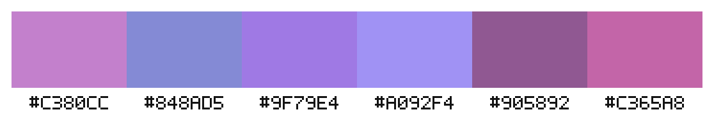
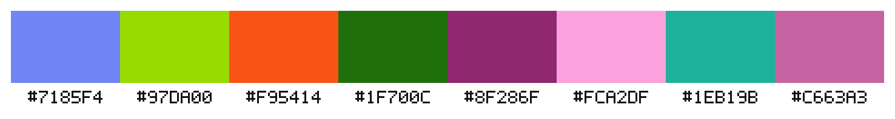
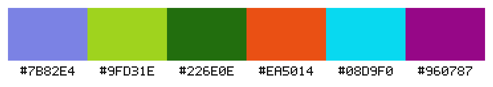
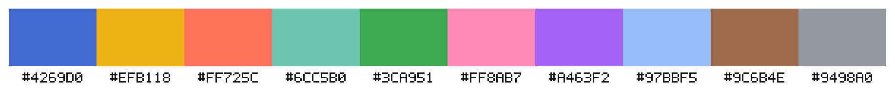
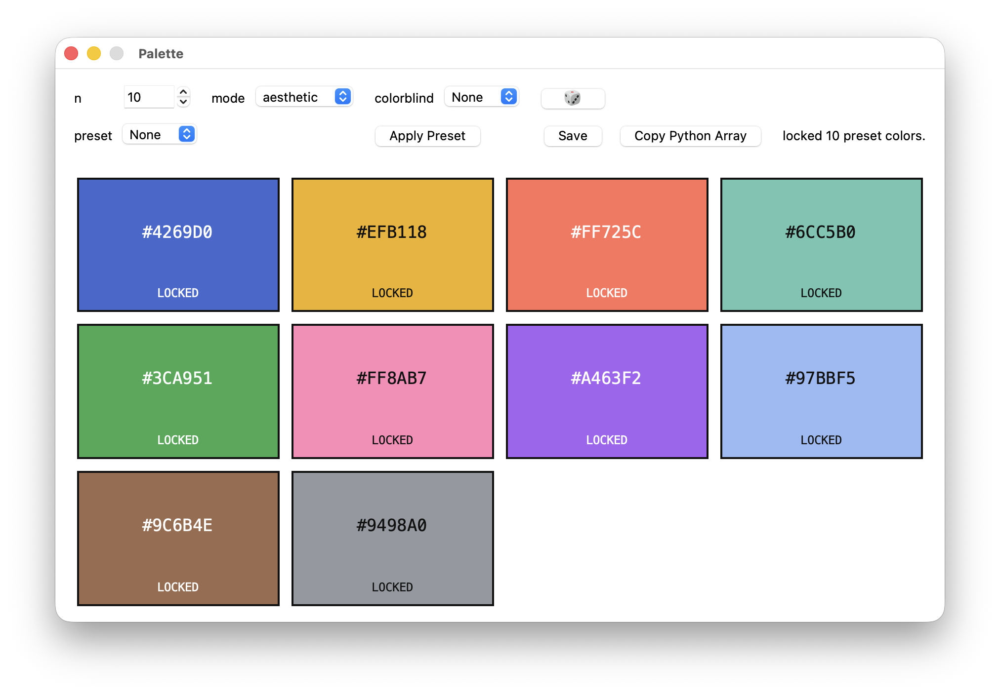

# Palette

[English README](README.md)

Palette는 색상 팔레트를 만드는 Python 라이브러리이자 작은 데스크톱 UI입니다.
용도는 크게 두 가지로 나뉩니다.

- `aesthetic`: UI, 발표 자료, 디자인 작업처럼 한 분위기로 묶이는 팔레트
- `categorical`: 논문 그림이나 차트처럼 항목끼리 잘 구분되는 팔레트

반환값은 항상 대문자 `#RRGGBB` 문자열입니다. 사용자가 지정한 색을 앞에
그대로 두고, 나머지 색만 어울리게 채울 수도 있습니다.

## 예시

**Aesthetic 팔레트**



```python
Palette(mode="aesthetic", seed=42).generate(n=6)
```

**Categorical 팔레트**



```python
Palette(mode="categorical", seed=42).generate(n=8)
```

**색각 이상 조건을 고려한 categorical 팔레트**



```python
Palette(mode="categorical", colorblind="deuteranopia", seed=42).generate(n=6)
```

**Observable 프리셋**



```python
preset_colors("observable")
```

## 기능

- `mode="aesthetic"`으로 분위기가 맞는 디자인 팔레트를 생성합니다.
- `mode="categorical"`로 차트와 논문 그림에 쓰기 좋은 구분형 팔레트를 생성합니다.
- 사용자가 입력한 색을 고정한 채 나머지 색을 채울 수 있습니다.
- 색각 이상 옵션을 지원합니다.
- 논문 그림에 자주 쓰이는 저널 스타일 프리셋을 제공합니다.
- Tkinter 기반 데스크톱 UI를 제공합니다.
- 별도 이미지 라이브러리 없이 팔레트 미리보기를 PNG로 저장합니다.

## 설치

프로젝트 루트에서 실행합니다.

```bash
python3 -m pip install -e .
```

이 명령은 `palette` 패키지와 `palette-ui` 실행 명령을 설치합니다.
로컬에서 개발하거나 바로 수정해 가며 쓸 때는 editable 설치가 편합니다.

테스트까지 실행하려면 다음처럼 설치합니다.

```bash
python3 -m pip install -e ".[test]"
python3 -m pytest -q
```

## 라이브러리 사용법

먼저 `Palette`를 불러옵니다.

```python
from palette import Palette
```

디자인용 팔레트를 만들 때는 `aesthetic` 모드를 씁니다.

```python
colors = Palette(mode="aesthetic", seed=42).generate(n=5)
print(colors)
```

논문 그래프나 차트처럼 색을 서로 확실히 구분해야 할 때는 `categorical`
모드를 씁니다.

```python
colors = Palette(mode="categorical", seed=42).generate(n=8)
print(colors)
```

색각 이상 조건을 고려할 수도 있습니다.

```python
colors = Palette(
    mode="categorical",
    colorblind="deuteranopia",
    seed=42,
).generate(n=6)
```

이미 정해 둔 색이 있으면 `seed_colors`로 넘깁니다. 입력한 색은 반환된
팔레트 앞쪽에 그대로 유지됩니다.

```python
colors = Palette(mode="aesthetic").generate(
    n=4,
    seed_colors=["#1E88E5"],
)
print(colors)
# ["#1E88E5", ...]
```

지원하는 `mode` 값은 다음과 같습니다.

- `aesthetic`: UI, 발표 자료, 디자인처럼 한 시각적 분위기가 필요한 경우
- `categorical`: 차트, 논문 그림, 그룹 비교처럼 색을 구분해야 하는 경우

지원하는 `colorblind` 값은 다음과 같습니다.

- `None`
- `"protanopia"`
- `"deuteranopia"`
- `"tritanopia"`
- `"achromatopsia"`

색상 입력은 `#RGB`, `#RRGGBB`, `#RRGGBBAA` 형식을 받습니다. 출력은 항상
대문자 `#RRGGBB`로 정규화됩니다. 잘못된 입력은 `ValueError`를 발생시킵니다.

## 어떤 모드를 써야 하나요?

비슷한 계열의 색으로 화면이나 문서의 분위기를 맞추고 싶다면 `aesthetic`을
쓰면 됩니다.

```python
Palette(mode="aesthetic").generate(n=6)
```

실험군, 모델, 카테고리처럼 각각의 색이 명확히 달라야 한다면
`categorical`이 더 맞습니다.

```python
Palette(mode="categorical").generate(n=6)
```

## 프리셋

논문 그림에 쓰기 좋은 categorical 프리셋을 함께 제공합니다.

```python
from palette import Palette, list_presets, preset_colors

list_presets()
preset_colors("observable", n=5)
Palette(mode="categorical").preset("nejm", n=10)
```

포함된 프리셋은 다음과 같습니다.

- `npg`
- `observable`
- `bmj`
- `science`
- `nejm`
- `lancet`
- `jco`

일부 프리셋 원본은 `#RRGGBBAA` 형식이지만, Palette는 이를 `#RRGGBB`로
정규화합니다. `n`이 프리셋 색상 수보다 크면 프리셋 색을 먼저 두고,
부족한 색은 알고리즘으로 추가 생성합니다.

```python
palette = Palette(mode="categorical", seed=7).preset("nejm", n=10)
print(palette)
# 앞의 8개는 NEJM 프리셋이고, 뒤의 2개는 새로 생성된 색입니다.
```

## 데스크톱 UI



설치 후 다음 명령으로 실행합니다.

```bash
palette-ui
```

로컬 개발 중에는 런처 파일을 바로 실행해도 됩니다.

```bash
python3 palette_ui.py
```

UI에서 할 수 있는 일은 다음과 같습니다.

- `n` 값을 지정해 색상 개수를 정합니다.
- 프리셋을 적용합니다.
- 주사위 버튼으로 새 팔레트를 생성합니다.
- 색상 사각형을 클릭해 고정하거나 해제합니다.
- 색상 사각형을 더블클릭해 HEX 코드를 직접 입력합니다.
- 팔레트를 `outputs/` 폴더에 PNG로 저장합니다.
- 현재 팔레트를 Python 배열 문자열로 복사합니다.

프리셋을 적용하면 프리셋 색상은 자동으로 고정됩니다. `n`이 프리셋보다
크면 원래 프리셋 색상만 고정되고, 추가 생성된 색은 고정되지 않습니다.

일반적인 사용 흐름은 다음과 같습니다.

1. `n` 값을 정합니다.
2. 모드를 고릅니다.
3. 프리셋을 적용하거나 주사위 버튼을 누릅니다.
4. 유지할 색상은 클릭해서 고정합니다.
5. 다시 주사위 버튼을 눌러 고정되지 않은 색만 바꿉니다.
6. 필요한 색은 더블클릭해서 직접 입력합니다.
7. PNG로 저장하거나 Python 배열 문자열로 복사합니다.

## 알고리즘

Palette는 내부 계산에 OKLab/OKLCH를 사용합니다. RGB나 HSV보다 명도,
채도, 색상 차이를 사람이 느끼는 방식에 가깝게 다루기 위해서입니다.

`aesthetic` 모드는 여러 후보 팔레트를 만든 뒤 점수화해 고르는 방식입니다.
유사색과 톤 중심의 후보를 만들고, 색상 응집도, 명도 대비, 채도 균형,
중립색과 포인트 색의 비율, 중복 색 회피, 탁하거나 지나치게 튀는 색에 대한
패널티를 함께 봅니다.

`categorical` 모드는 Glasbey 방식과 비슷한 greedy farthest-point 전략을
사용합니다. 이미 고른 색들과 지각적으로 멀리 떨어진 색을 차례로 고릅니다.

색각 이상 옵션을 켜면 protanopia, deuteranopia, tritanopia, achromatopsia
조건에서 보이는 색을 근사한 뒤, 그 상태에서도 색들이 충분히 구분되는지
확인합니다.

알고리즘 출처와 구현에 반영한 방식은 [REFERENCES.md](REFERENCES.md)에
정리해 두었습니다.

## 라이선스

Palette는 [MIT License](LICENSE)로 배포됩니다.

MIT 라이선스는 이 프로젝트에 잘 맞습니다. 짧고 permissive한 라이선스라
사용, 수정, 배포, 상업적 사용을 폭넓게 허용하면서 저작권과 라이선스 고지만
유지하도록 요구합니다.

## 개발

```bash
python3 -m pip install -e ".[test]"
python3 -m pytest -q
python3 -m compileall -q src palette_ui.py
```

PNG 내보내기는 별도 이미지 생성 라이브러리에 의존하지 않습니다. UI는 Python
표준 라이브러리만으로 간단한 PNG 파일을 씁니다.
